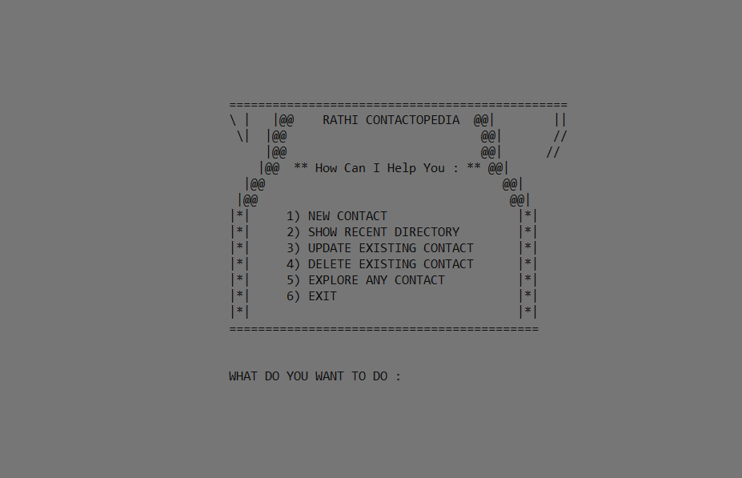

# Telephone-Directory

This is a C++ programming based project. Its a telephone directory.
   
Everything is done by file handling in C++.
 

We can perform all the operations that are required to manage directory

<ul>
  <li>Add Contact</li>
  <li>Delete Existing Contact</li>
  <li>Search Contacts</li>
  <li>Update Existing Contacts</li>
  <li>Show All that are present in Directory</li>
</ul>

   
  Here how it looks : 

